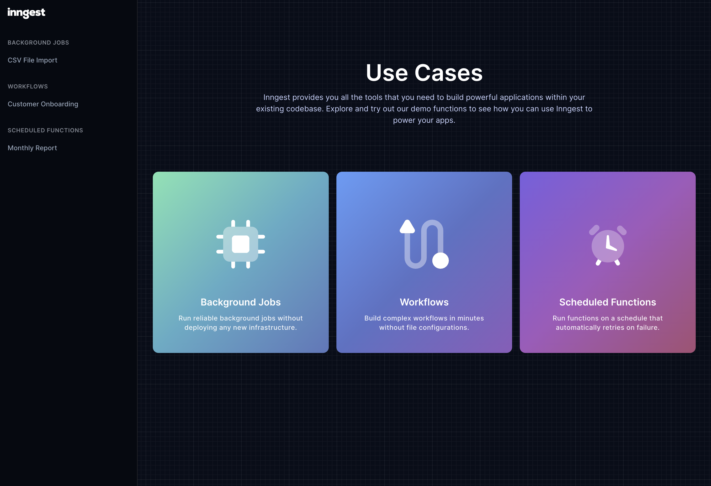

# Inngest Demo

This is a demo application for Inngest that includes examples of use cases. You can use this as a
starting point for your own application.



## Installation

You can try out this demo by installing it locally with one of the following commands:

```shell
npm create next-app@latest -- --example https://github.com/inngest/inngest-demo inngest-demo-app
# or
yarn create next-app --example https://github.com/inngest/inngest-demo inngest-demo-app
# or
pnpm create next-app@latest --example https://github.com/inngest/inngest-demo inngest-demo-app
```

## Usage

After installing the demo, you can run it locally with the following commands:

```shell
cd inngest-demo-app

# If you used npm
npm run dev
# If you used yarn
yarn dev
# If you used pnpm
pnpm dev
```

Open both of the following URLs in your browser to see the demo app and the Inngest Dev Server:

- Demo App ([http://localhost:3000 ](http://localhost:3000))
- Inngest Dev Server ([http://localhost:8288](http://localhost:8288))
